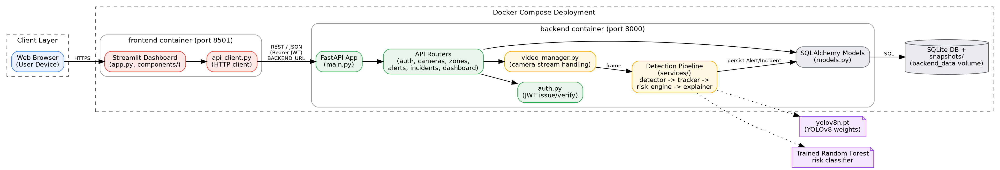
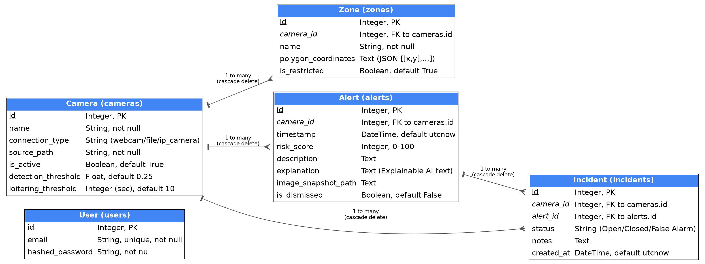
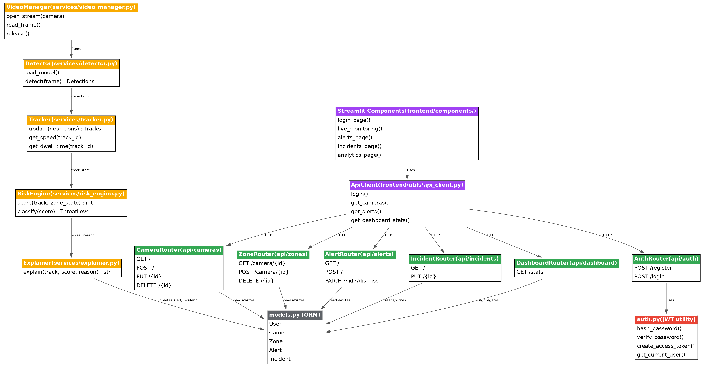
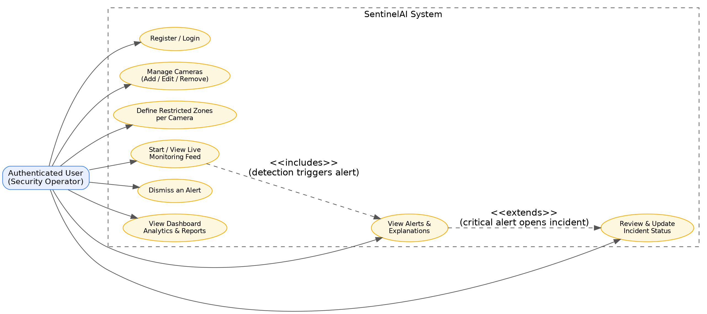
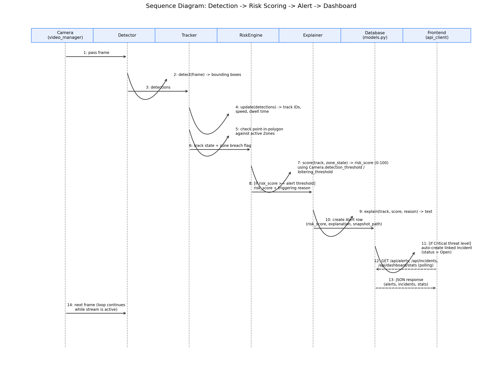
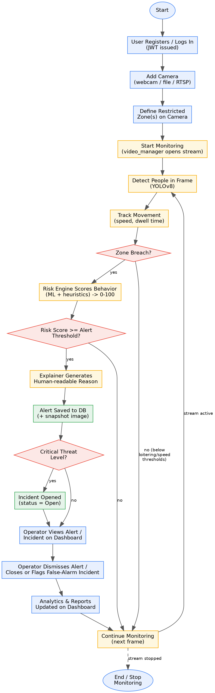

# SentinelAI 🛡️


**AI-powered surveillance intelligence engine** — detects people in video feeds, tracks their behavior, and flags suspicious activity in real time with human-readable, explainable reasoning.

---

## Overview

SentinelAI turns a plain video feed (webcam, file, or IP camera) into a smart monitoring system. It detects people using YOLOv8, tracks their movement across frames, and scores their behavior for risk using a hybrid of a trained machine learning model and rule-based heuristics — flagging things like loitering in restricted zones or fast/running movement. Every alert comes with an AI-generated explanation of *why* it was flagged.

## Features

- 🎥 **Multi-camera support** — webcam, video file, or IP camera (RTSP) sources
- 🧍 **Real-time object detection & tracking** using YOLOv8
- 🚧 **Restricted zone management** — define polygon zones per camera
- ⚠️ **Risk scoring engine** — blends a Random Forest classifier with heuristic rules (loitering time, speed, zone breaches) to produce a 0–100 risk score and threat level (Low / Warning / Critical)
- 💬 **Explainable AI** — every alert includes a natural-language explanation of the triggering behavior
- 📊 **Dashboard & analytics** — live monitoring, alerts log, incidents log, and reporting via a Streamlit UI
- 🔐 **JWT authentication** for the API and frontend

## Screenshots

<details>
<summary>Click to expand: Application Screenshots</summary>

<table>
  <tr>
    <td align="center"><b>Login Page</b><br/></td>
    <td align="center"><b>Live Surveillance</b><br/></td>
  </tr>
  <tr>
    <td align="center"><b>Surveillance Dashboard</b><br/></td>
    <td align="center"><b>Threat Log</b><br/></td>
  </tr>
</table>

</details>

## Architecture

```
SentinelAI/
├── backend/                # FastAPI backend
│   ├── app/
│   │   ├── api/             # Route handlers (auth, cameras, zones, alerts, incidents, dashboard)
│   │   ├── services/        # Detection pipeline
│   │   │   ├── detector.py     # YOLOv8 object detection
│   │   │   ├── tracker.py      # Multi-object tracking (speed, dwell time)
│   │   │   ├── risk_engine.py  # ML + heuristic risk scoring
│   │   │   ├── explainer.py    # Explainable AI text generation
│   │   │   └── video_manager.py
│   │   ├── models.py        # SQLAlchemy models (User, Camera, Zone, Alert, Incident)
│   │   ├── schemas.py       # Pydantic schemas
│   │   ├── auth.py          # JWT auth logic
│   │   ├── config.py        # App settings
│   │   └── main.py          # FastAPI app entrypoint
│   ├── data/snapshots/      # Saved alert snapshots
│   ├── tests/                # Pytest suite
│   └── requirements.txt
├── frontend/                # Streamlit dashboard
│   ├── components/          # Login, dashboard, live monitoring, alerts, incidents, cameras, zones, analytics, settings
│   ├── utils/api_client.py  # Backend API client
│   ├── app.py                # Streamlit entrypoint
│   └── requirements.txt
└── requirements.txt          # Combined dependencies for local dev
```

**Tech stack:** FastAPI · SQLAlchemy · SQLite · YOLOv8 (Ultralytics) · PyTorch · OpenCV · scikit-learn · Streamlit · Plotly

## Getting Started

### Prerequisites
- Python 3.10+
- pip / virtualenv

### 1. Clone the repo
```bash
git clone https://github.com/AaryanInzalkar/SentinelAI.git
cd SentinelAI
```

### 2. Set up a virtual environment
```bash
python -m venv .venv
.venv\Scripts\activate      # Windows
source .venv/bin/activate   # macOS/Linux
```

### 3. Install dependencies
```bash
pip install -r requirements.txt
```

### 4. Run the backend
```bash
python backend/run.py
```
The API will be available at `http://localhost:8000`. Interactive docs at `http://localhost:8000/docs`.

### 5. Run the frontend
In a separate terminal (with the venv activated):
```bash
streamlit run frontend/app.py
```

### Default login
On first run, the backend seeds a default admin account:
```
email:    admin@sentinel.ai
password: admin123
```
⚠️ **Change this before any real deployment.** Also rotate the `SECRET_KEY` in `backend/app/config.py` (or set it via a `.env` file) — the default value is for local development only.

## Running Tests
```bash
pytest backend/tests/
```

## Roadmap Ideas
- Real IP camera / RTSP stream support hardening
- Multi-user roles & permissions
- Cloud storage for snapshots/video
- Notification integrations (email, Slack, SMS)

## Design Diagrams

<details>
<summary>Click to expand: System Architecture, ER, Class, Use Case, Workflow &amp; Sequence Diagrams</summary>

<p align="center"><b>System Architecture</b></p>
<p align="center">
  
</p>

<br/>

<table>
  <tr>
    <td align="center" width="50%">
      <b>Entity-Relationship (ER) Diagram</b><br/><br/>
      
    </td>
    <td align="center" width="50%">
      <b>Class / Component Diagram</b><br/><br/>
      
    </td>
  </tr>
  <tr>
    <td align="center" width="50%">
      <b>Use Case Diagram</b><br/><br/>
      
    </td>
    <td align="center" width="50%">
      <b>Sequence Diagram</b><br/><br/>
      
    </td>
  </tr>
</table>

<br/>

<p align="center"><b>Workflow / Process Diagram</b></p>
<p align="center">
  
</p>

</details>

## License
MIT
